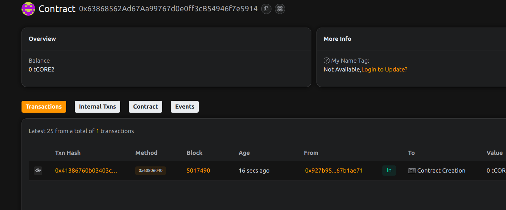

# Project Title: P2E Safehouse: Escrow for Play-to-Earn Rewards 
  
project done by Anurag Chouhan                        
         
## Project Description 

P2E Safehouse is an escrow protocol for Web3 games to securely hold and disburse play-to-earn rewards. Game developers deposit rewards that players can later claim, ensuring transparency and security.

## Project Vision

To build a reliable and abuse-proof reward infrastructure for on-chain and off-chain games that distribute digital assets as earnings.

## Key Features

- Secure ETH-based reward deposit by game admins
- Players claim rewards at their convenience
- Transparent on-chain record of rewards and claims
- Prevents premature or unauthorized disbursement

## Future Scope

- Support ERC-20 and NFT-based rewards
- Scheduled or milestone-based reward releases
- Reward tracking dashboard for players
- Multi-admin support and auditing

## Contract Details

0x63868562Ad67Aa99767d0e0ff3cB54946f7e5914

